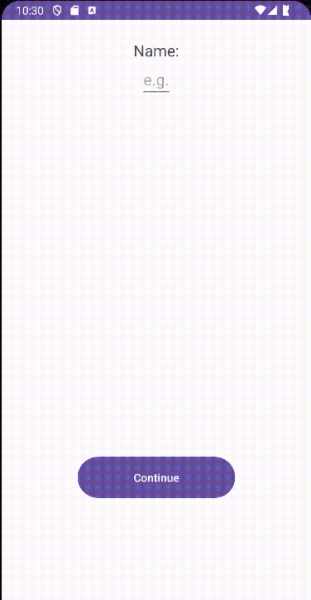

Language : us | [ru](./README.ru-RU.md)

# Changing Screens
The program is very simple, it consists in the fact that you can switch between screens

 

## Compatibility

|  Android |  Apple |
:-------:|:-------:|
|    ✔️  |    ❌  |

