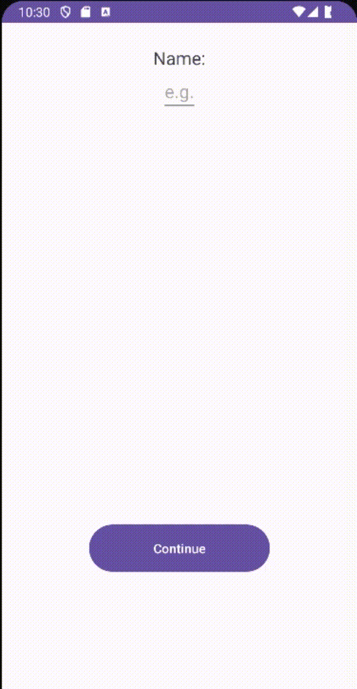

Язык : [us](./README.md) | ru

# Меняющиеся экраны
Программа очень проста, она заключается в том, что вы можете переключаться между экранами

 

## Совместимость

|  Android |  Apple |
:-------:|:-------:|
|    ✔️  |    ❌  |

